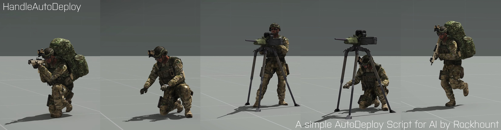

# ArmA 3 Script HandleAutoDeploy

  

# Support
There will be no official support.

# Pull Requests
Official-Code will remain as it is, but you are free to change it for your purposes.

## Content
It is a single ~80Code-Line-Big Script to let AI's with specific backpack's deploy static weapons automatically in a combat.

## Purpose
The aim of this script is to make it easier to implement a universal script, which makes a combat with AI more interesting.

## Story
This is a script that I wrote a few weeks ago for a friend. It's supposed to let AI's with specific backpack's deploy static weapons automatically in a combat. You can link specific backpacks with specific static weapons multiple times. This script doesn't work, if the AI is in a combat mode all the time or if the AI never gets to be in a combat mode. There are several routine integrated to avoid script errors. A description can be found inside the SQF file, how to execute the script. It's SP/MP/Dedicated and HC compatible. Have fun.

## Media

### Showcase #1 (Clip)

